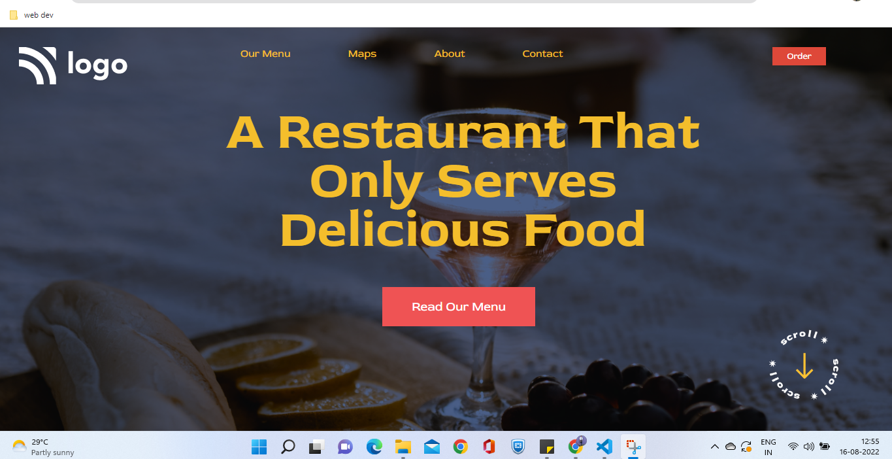

## Project 2 from web dev bootcamp - Ineuron
# [Live website Link](https://restaurant-basic.netlify.app/)
### In this project, I learnt about using a background Image to build a static website. Using gradient color on the background image was something that I had never done before. 

### Website Preview:-

